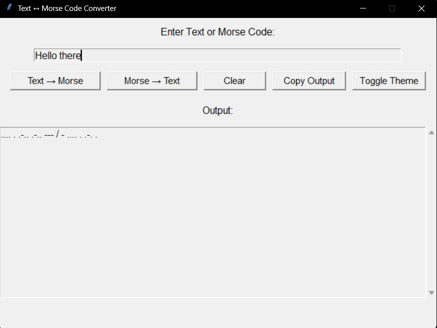

# Text ↔ Morse Code Converter

## Project Overview
This is a Python-based GUI application that allows users to convert between regular text and Morse code, with the added feature of playing Morse code as audible beeps. The application is designed to be user-friendly, interactive, and visually appealing, making it suitable for beginners learning Morse code or developers exploring text-to-sound integration.

## Screenshot
Here’s what the app looks like when running:

## Key Features

### Text to Morse Conversion
- Converts any standard text input into Morse code.
- Ignores unsupported characters with a pop-up notification.

### Morse to Text Conversion
- Decodes Morse code into readable text.
- Handles word separation using `/` and letter separation with spaces.
- Alerts the user if unsupported Morse sequences are detected.

### Sound Playback
- Plays Morse code using system beeps (`winsound` module).
- Dots (`.`) produce short beeps, dashes (`-`) produce long beeps.
- Includes pauses for letters and words to mimic real Morse code rhythm.

### Interactive GUI
- Built using `Tkinter`.
- Input field for text or Morse code.
- Buttons for conversion, clearing input/output, copying results, and toggling themes.
- Scrollable output area to handle long messages.
- Light/Dark theme toggle for visual comfort.

### Convenience Features
- **Copy Output**: Easily copy converted text/Morse code to clipboard.
- **Clear All**: Reset input and output fields instantly.

## Technical Implementation

### Dictionaries for Conversion
- `MORSE_CODE_DICT`: Maps letters, numbers, and symbols to Morse code.
- `MORSE_CODE_DICT_REVERSE`: Reverse lookup dictionary for decoding Morse code to text.

### Sound Integration
- Utilizes the built-in `winsound` module for Windows beep playback.
- Customizable beep durations simulate dots and dashes.

### GUI Design
- Clean layout: Input → Buttons → Output.
- Scrollable output for large text/Morse code.
- Button font sizes and spacing optimized for readability.
- Theme toggle enhances accessibility.

### Error Handling
- Informative pop-ups alert users to:
  - Empty input fields.
  - Unsupported characters or Morse sequences.

## Why This Project Stands Out
- Combines text processing, GUI design, and audio feedback.
- Demonstrates thoughtful error handling and user-centric design.
- Shows ability to integrate multiple Python modules (`tkinter`, `winsound`, `time`) into a cohesive application.
- Portfolio-worthy because it balances functionality, interactivity, and polish.

## Potential Enhancements
- Adjustable beep speed and frequency for custom Morse code playback.
- Save output to `.txt` file.
- Keyboard shortcuts for faster navigation.
- Multi-platform audio support (Linux/macOS) without relying on Windows-specific modules.

## How to Run
1. Ensure Python 3.x is installed on your Windows machine.
2. Clone the repository:
   
   `git clone https://github.com/legophil101/Text-to-Morse-Converter.git`

3. Navigate to the project directory:

   `cd Text-to-Morse-Converter`

4. Run the Python script:

   `python TextToMorseConverter.py`

5. Enjoy converting text ↔ Morse code with sound feedback!
